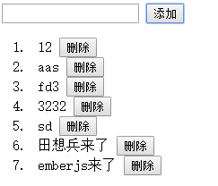

#ember-data &　ember-localstorage-adapter
数据模型和本地存储
##准备工作
首先我们加入`ember-data`和`ember-localstorage-adapter`两个依赖项,使用`bower install`安装这两个插件。如下
	
	"dependencies": {
	"jquery": "~1.9.1",
	"ember": "~1.13.10",
	"handlebars":"~1.3.0",
	"ember-data":"~1.13.11",
	"ember-localstorage-adapter":"latest"
	}

然后就可以开始我们今天的例子了，我们今天要做的事情和【[初学emberjs](../test1/README.md "初学emberjs")】并没有太多的不一样，只是之前的数据源采用的数组，而且数据在刷新后就没了，而今天要做的就是把数组换成emberjs的数据模型，然后保存到localstorage中，所以预览效果的话要浏览器支持localstorage.

ok,还是新建一个.html页面和一个app.js文件，然后在html中引入js

	
	
	
	
	
	
	

这里比之前多引用了`ember-data`和`localstorage_adapter`。

我们试想的场景还是一个初始的列表，然后我们对它进行增删改，这些改动都同步到本地，刷新也存在。我们先把列表显示出来：

	

然后我们在index的Route中返回一个store.

	App.IndexRoute = Ember.Route.extend({
		model: function() {
			return this.store.find('test');
		}
	});

它的意思是在store里查找一个命名空间叫test的数据对象模型，它里面有一个`content`的属性，就是对应的数据集了，所以在上面的each中我们可以`{{#each content}}`或者`{{#each controller}}`*(不推荐)*.

一开始是没有数据的，我们再上面的模板里再加一个输入框和一个添加按钮：

	{{input value=title}}
	<button {{action "add"}}>添加</button>

这里的input绑定了一个title的属性，老的写法是`valueBinding="title"`,但新版似乎并不推荐这么写了，这个title就对应到了controller里的属性了，button上加了一个add的action.

	App.IndexController = Ember.ArrayController.extend({
		title:null,
		actions:{
			add:function(){
		}
	});

好，我们还要为刚才的`store`注册一个适配器，emberjs有一个默认的适配器`RESTAdapter`，它是用为提交网络请求的，就是在你增删改的时候都会向服务器提交ajax返回json，但这次我们并不需要它，我们要用到的是`ember-localstorage-adapter`。

	/** Ember Data **/
	App.Test = DS.Model.extend({
	     title: DS.attr('string'),
		desc: DS.attr('string')
	});
	App.ApplicationAdapter = DS.LSAdapter.extend({
		namespace: 'test'
	});

这里我们建了一个有两个字段的模型，然后加了一个命名空间叫test的适配器，好，我们接着actions的add操作编写代码，要新增一条记录可以使用`store.createRecord`方法。

	actions:{
		add:function(){
			console.log(this.get('content'))
			console.log(this.get('title'))
			var newRecord= this.store.createRecord('test');
			newRecord.set('title',this.get('title'));
			newRecord.save();
		}
	}

我们在test创建一个记录，然后set它的值，这里还有另外一种写法,就是使用createRecord的第二参数，传入新增的对象

	var newRecord= this.store.createRecord('test',{
		title:this.get('title')
	});

打开网页，我们试下效果

然后我们按照上节的例子加入删除的action

	del:function(record){
		this.store.deleteRecord(r);
		r.save();
	}

修改的操作和【[初学emberjs](../test1/README.md "初学emberjs")】里的类似，这里就不重复贴了，我会在后面的源码中加入这个代码功能。